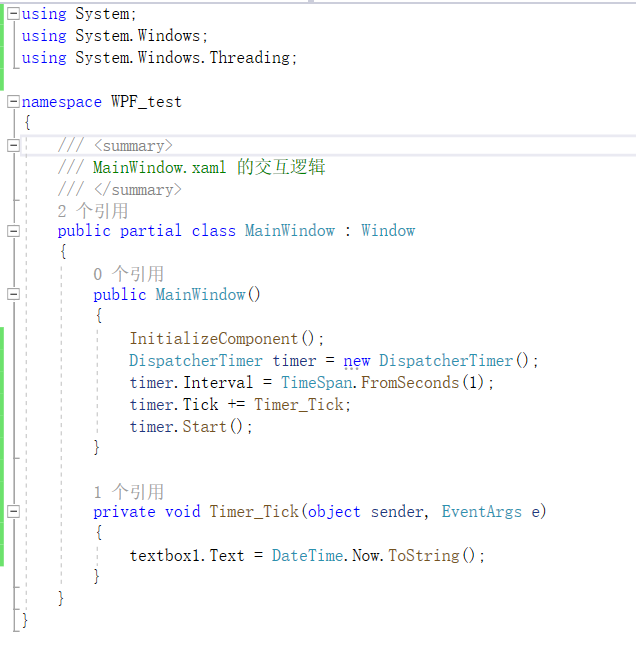

## 一、类

类是对现实世界事物进行抽象所得到的结果

## 二、类与对象的关系

- 对象也叫实例，是类经过“实例化”后得到的内存中的实体
- 依照类，我们可以创建对象，这就是“实例化”
- 使用new操作符创建类的实例
- 引用变量与实例的关系  

## 三、类的三大成员

- 属性（Property）
  - 存储数据，组合起来表示类或对象当前的状态
- 方法（Method）
  - 由C语言的函数（function）进化而来，表示类或对象“能做什么”
  - 工作中90%的时间是在与方法打交道，因为它是“真正做事”、“构成逻辑”的成员
- 事件（Event）
  - 类或对象通知其他类或对象的机制，为C#所特有（Java通过其他办法实现这个机制）
  - 善用事件机制非常重要
- 某些特殊类或对象在成员方面侧重点不同
  - 模型类或对象重在属性，如Entity Framework
  - 工具类或对象重在方法，如Math，Console
  - 通知类或对象重在事件，如各种Timer

## 实例：WPF制作简易时钟

1. 创建WPF项目

2. 引用线程类

   ```
   using System.Windows.Threading;
   ```

3. 创建定时器实例

   ```
   DispatcherTimer timer = new DispatcherTimer();
   ```

4. 引用定时器属性

   ```
   timer.Interval = TimeSpan.FromSeconds(1);
   ```

5. 引用定时器方法

   ```
   timer.Tick += timer_Tick;		//+=在C#中表示把后面timer_Tick这个方法(函数)挂接到这个事件上，即事件每触发一次，就执行一次方法(函数)，该方法又叫事件处理器。
   ```

6. 事件处理器：在textbox显示实时时钟

   ```
   void timer_Tick(object sender,EventArgs e)
   {
   	this.textbox1.Text = DateTime.Now.ToString();
   }
   ```

7. 启动定时器

   ```
   timer.Start();
   ```

## 附图


