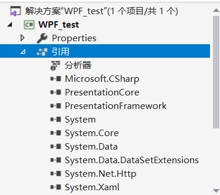
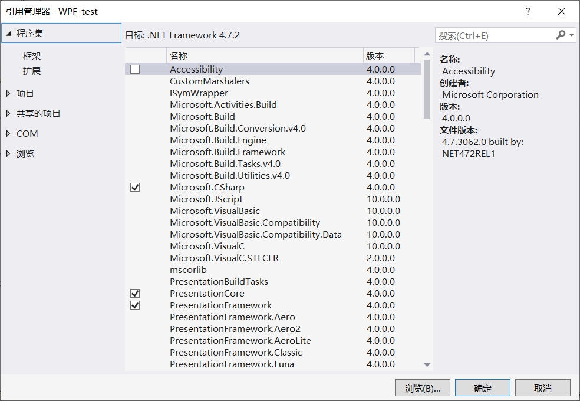

## 一、引用库文件





1. 引用官方库

- 鼠标右击工程目录下的引用，选择添加引用，进入引用管理器界面。在右上侧搜索栏输入官方库名，确定即可把官方库添加到工程中。

- 在程序中使用：

  - 程序中使用库中的类方法全称，例如：System.Windows.Threading。

  - 在文头引用库文件，格式为：using namespace。例如：

    ```c#
    using System.Windows.Threading
    
    
    Threading thread1 = new Threading()
    ```

2. 引用第三方库

- 在引用管理器界面，左侧栏选择浏览，选择本地需要引用的第三方库，可以是DLL动态库，也可以是源码.cs文件。
- 在程序中使用：同1

## 命名空间（namespace）

命名空间是每个库文件对外引用的接口。

引用库文件，需在程序文头添加：using namespace
