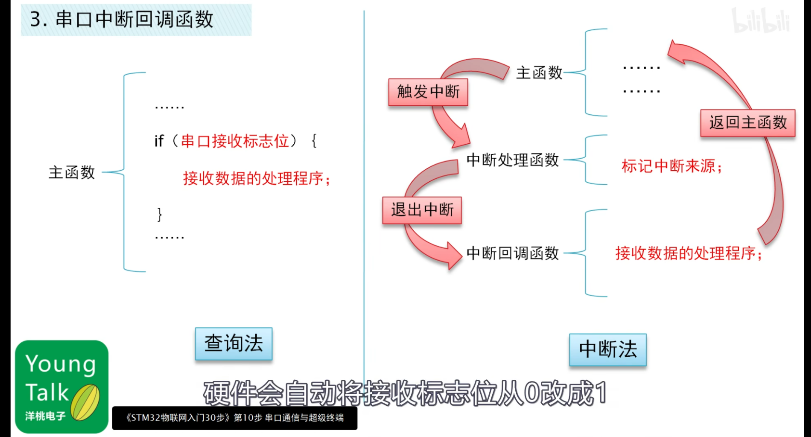
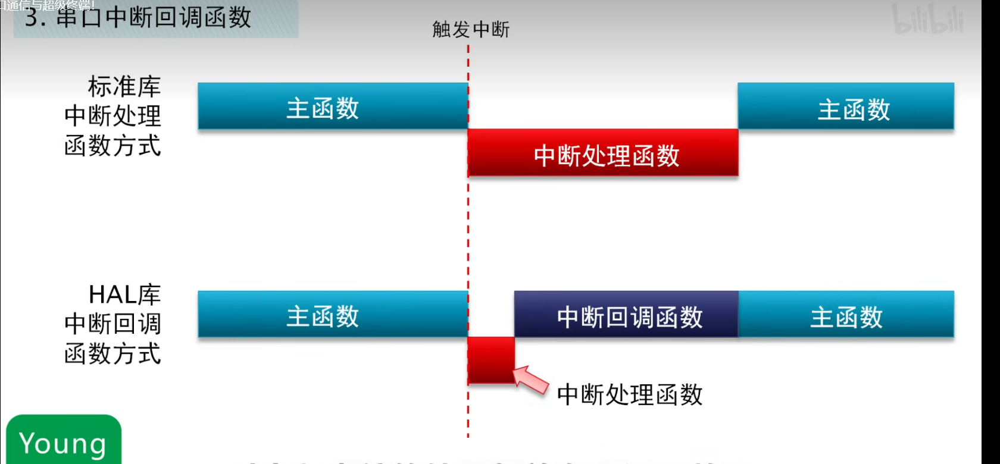

## 一、为什么要回调函数

***传统标准库的中断：在中断中进行数据处理，如果数据量比较大，再加上潜在的延时，极大的占用了CPU的时间，一直处在中断中，其他中断无法执行，主函数无法进行。***

**因此，在HAL库中，引入回调函数，工作方式如下图。即当发生中断时，cpu依旧进入中断处理函数（即中断入口），但中断处理函数不做数据处理，而是标记中断回调函数，退出中断，间接调用回调函数，然后在中断回调函数里执行数据的处理。好处就是，这样做给其他中断有了中断时间，不浪费中断资源。**






## 二、回调函数的使用

在CubeMX配置好后，相应的中断处理函数会在stm32f4xx_it.c中自动配置好，基本形式如下：

```C
void DMA2_Stream0_IRQHandler(void)
{
  /* USER CODE BEGIN DMA2_Stream0_IRQn 0 */

  /* USER CODE END DMA2_Stream0_IRQn 0 */
  HAL_DMA_IRQHandler(&hdma_adc1);
  /* USER CODE BEGIN DMA2_Stream0_IRQn 1 */

  /* USER CODE END DMA2_Stream0_IRQn 1 */
}
```

在中断处理函数中都会指向：

```C
HAL_XXX_IRQHandler(&XXX);
```

这个函数就会间接调用回调函数。回调函数在相应HAL驱动库的C文件中，前面有__week定义，其意义在于当用户有自己定义的回调函数时，优先执行用户的回调函数，用户回调函数名需与官方回调函数名一致。

形式如下：

```C
__weak void HAL_UART_RxCpltCallback(UART_HandleTypeDef *huart)
{
  /* Prevent unused argument(s) compilation warning */
  UNUSED(huart);
  /* NOTE: This function should not be modified, when the callback is needed,
           the HAL_UART_RxCpltCallback could be implemented in the user file
   */
}
```

**关于用户对于数据的处理以及一些自定义的需求，可以在此中断回调函数中编写。**
