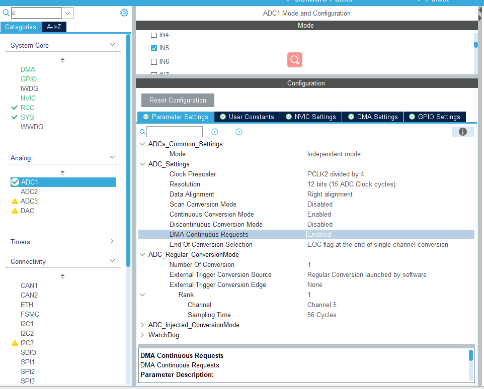
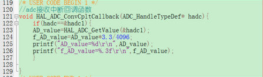
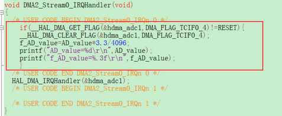

## 一、轮询法

1. 开启RCC时钟

2. CubeMX进行ADC配置：

   - 通道
   - 采用模式：一般选择连续采样模式
   - ......如下图

   

3. 编写程序：驱动基本都自动生成好了，主要编写主函数。

​		在主函数中添加如下代码：

```C
while(1)
{
    HAL_ADC_Start(&hadc1);
	HAL_ADC_PollForConversion(&hadc1, 10);	//参数二：10是等待时间
	HAL_ADC_Stop(&hadc1);
    buf2 = HAL_ADC_GetValue(&hadc1);
}
```


## 二、中断法

#### 方法一：

在CubeMX配置ADC中断，即可在对应文件自动生成中断处理函数，在ADC.c下编写用户中断回调函数即可，如下：



**需要注意的是：使用中断前，需要在主函数中添加如下代码（放在外设初始化函数之后，声明一次即可），确保中断使能，ADC开始工作：**

```C
__HAL_ADC_ENABLE_IT(&hadc1,ADC_IT_EOC);
HAL_ADC_Start(&hadc1);
```

#### 方法二：

直接在主函数中的外设初始化函数之后，添加如下代码：

```C
HAL_ADC_Start_IT(&hadc1);
```

此函数比较特殊，调用一次就相当于打开了**ADC转换完成中断**和**开启ADC采样**。

***注意：当ADC配置开启连续采集模式时，在中断回调函数结尾需要加上ADC中断使能函数HAL_ADC_Start_IT(&hadc)，来手动开启中断！！***

## 三、DMA

dma有两种模式，分别为circular和normal。

- circular模式：dma的circular模式只需要调用一次dma开启函数，dma就会持续的搬运数据，提高了数据的刷新速度，但是在circular模式下，不管adc新的一轮数据采集是否完成，有可能直接将旧数据搬运走。
- normal模式：该模式下，dma启动函数调用一次，dma通道只会搬运一次数据，这样每调一次dma启动函数，dma只会搬运一次数据，等待数据传输完成后再次开启dma启动函数，这样更能保证adc数据采集的可靠性。

#### Circular模式：

在CubeMX配置完ADC的DMA功能后，需要在主函数中调用如下代码（一次就行，即外设初始化后）：

```C
uint16_t AD_value=0;
float f_AD_value;

**************
//外设初始化
**************
    
HAL_ADC_Start_DMA(&hadc1,(uint32_t*)&AD_value,sizeof(AD_value));

while(1)
{
}
```

此外，CubeMX中配置完DMA，会在中断文件（stm32f4xx_it.c）中自动生成DMA中断处理函数，用户在此编写处理程序或中断回调函数中编写都可。

如下：



加上标志位检测，是为了确保DMA在Circular模式下数据不发生遗漏，错误。因此，在normal模式下，一般不加标志检测。

#### normal模式

与Circular模式配置基本相似，区别在于采集模式（ContinuousConvMode）的选择以及是否在中断处理中是否添加标志检测。


参考链接：https://blog.csdn.net/weixin_46461874/article/details/128686185?spm=1001.2101.3001.6650.5&utm_medium=distribute.pc_relevant.none-task-blog-2%7Edefault%7EYuanLiJiHua%7EPosition-5-128686185-blog-117872009.pc_relevant_3mothn_strategy_recovery&depth_1-utm_source=distribute.pc_relevant.none-task-blog-2%7Edefault%7EYuanLiJiHua%7EPosition-5-128686185-blog-117872009.pc_relevant_3mothn_strategy_recovery&utm_relevant_index=8
