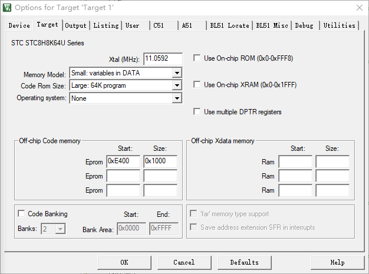
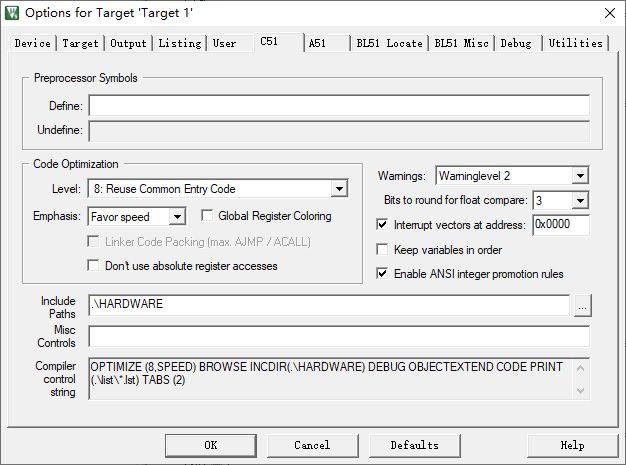
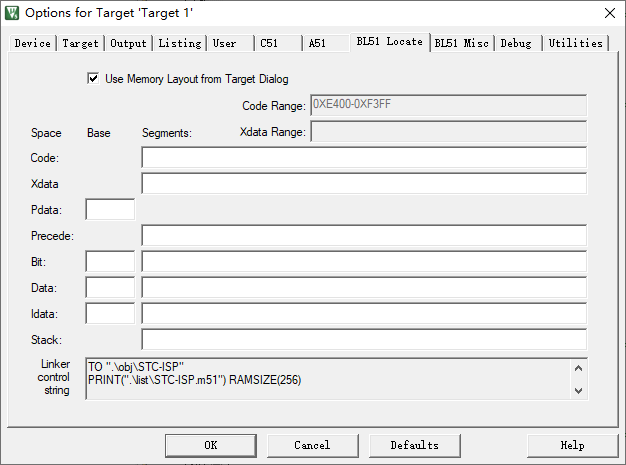

## 一、BootLoader程序KEIL环境配置

##### 1.设置程序起始地址

##### 2.中断向量偏移地址（BootLoader程序无需设置）

##### 3.链接器地址设置——BL51 Locate（BootLoader程序无需设置）

## 二、用户程序KEIL环境配置

此处无需设置。因为用户程序在首地址。

***如果是BootLoader程序在首地址，则用户程序不仅需要修改程序起始地址，还需要修改中断偏移地址，链接器地址配置***

***但是根据实践，在keil中更改用户程序地址三要素，会产生意想不到的错误！***

