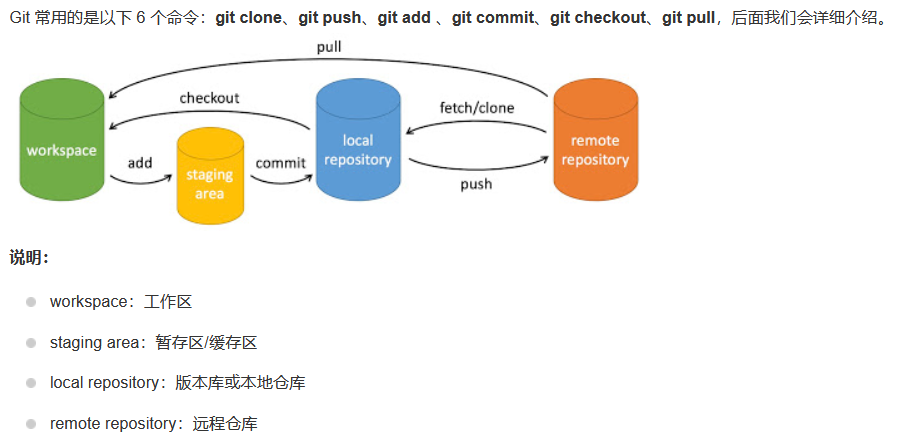

### 一个简单的操作步骤
	git init    
	git add .   
	git commit

- git init    -初始化仓库。
- git add .   -添加文件到暂存区。
- git commit  -将暂存区内容添加到仓库中。 

### 创建仓库命令

|  命令  | 说明 |
|-------|------|
|git init|初始化仓库|
|git clone|拷贝一份远程仓库，也就是下载一个项目|

### 提交与修改

|  命令  | 说明 |
|-------|------|
|git add|添加文件到暂存区|
|git status|查看仓库当前的状态，显示有变更的文件|
|git commit|提交暂存区到本地仓库|
|git rm|将文件从暂存区和工作区中删除|

### 提交日志
|  命令  | 说明 |
|-------|------|
|git log|查看历史提交记录|
|git blame <file>|以列表形式查看指定文件的历史修改记录

### 远程操作
|  命令  | 说明 |
|-------|------|
|git remote|远程仓库操作|
|git fetch|从远程获取代码库|
|git pull|下载远程代码并合并|
|git push|上传远程代码并合并|

### 创建并切换分支
	git checkout -b 分支名

### 查看分支
	git branch 		//查看本地分支
	git branch -a	//查看本地和远程分支

# 一次完整的操作
	git add .
	git commit -m <comments>
	git push origin branch

\<comments> 为注释，如注释字符串中间没有空格，则不加任何符号。如中间有空格，则加双引号括起来。

origin：远程仓库  
branch：为需要提交的分支