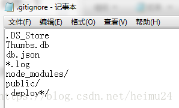

## 换了电脑怎么办？

我们要的是blog文件夹，你可以从一台电脑拷贝到另一台电脑，但是这似乎太麻烦了。。不现实

## 解决方案：

1、在你的github上新建一个repository，然后把你的blog文件夹上传，进行备份，这个很简单这里不再赘述

2、在现有的heimu24.guthub.io的repository下创建一个分支来管理，具体操作步骤如下：

### 一：建立分支hexo
##### 1、在本地D盘下（位置任意）右键Git bash here，执行以下指令，把heimu24.github.io项目文件克隆到本地：

    git clone git@github.com:heimu24/heimu24.github.io.git

##### 2、然后D盘下就会有个heimu24.github.io的文件夹，里面的文件就是repository上的。

##### 3、进入heimu24.github.io，删除文件夹里除了.git的其他所有文件

##### 4、把你的blog文件夹内的所有文件全部复制到heimu24.github.io/下

##### 5、里面应该有个叫.gitignore的文件，没有的话就自己创建一个，里面的内容如下：




ps：.gitignore文件就是为了指定哪些文件上传的时候可以忽略，因为blog/的文件并不全部都需要

##### 6、创建一个叫hexo（或者blog，名字随意）的分支，并切换到这个分支

```
git checkout -b hexo
```

7、添加所有文件到暂存区

    git add --all

8、进行提交

    git commit -m ""

9、推送hexo分支的文件到github仓库

```
git push --set-upstream origin hexo
```

## 发表博客

#### 1、把你写好的博客.md文件放到D:\heimu24.github.io\source\_posts中，如下图  

#### 2、然后执行指令，然后就可以去网站查看效果了。 ps：如果要删除文章，直接本地删除，然后再次执行以下两句指令就行了。如果不行就先执行一下 hexo clean，再执行下面语句 hexo g #生成 hexo d #部署 博客发表了，你的网站更新了（是因为heimu24.github.io的master下的文件更新了)，接下来我们备份的blog也应该要更新啊 


## 今后如果换电脑的话

配置好基本的环境，npm install 安装依赖，然后克隆分支到本地

```
git clone -b hexo git@github.com:heimu24/heimu24.github.io.git
```

ps： -b就是branch分支的意思，hexo就是hexo分支，后面的地址就是你自己的repository地址 
 至此，环境配置好了，hexo文件克隆到了本地，你就可以按照以前的步骤发博客了
