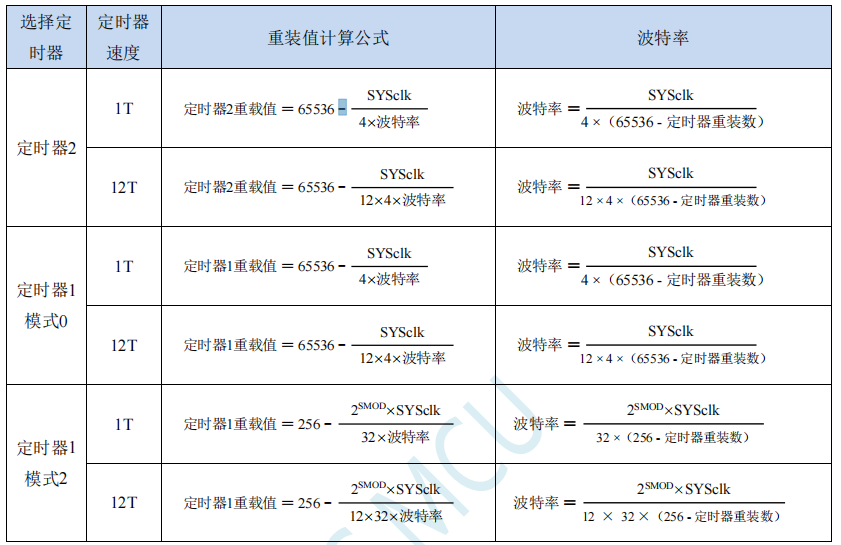
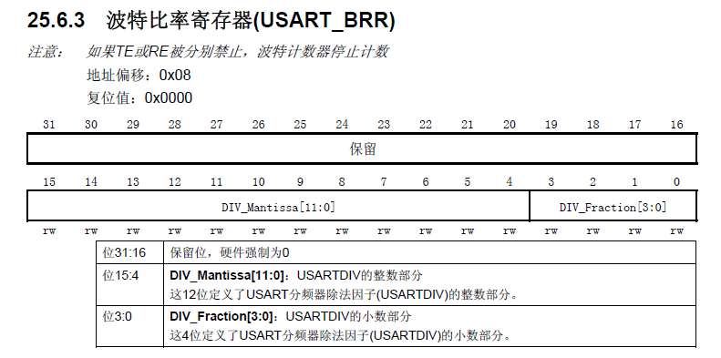
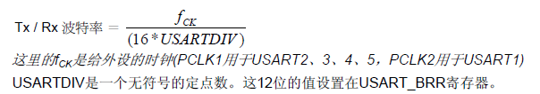

## 一、stc单片机串口波特率的产生

#### 1.stc单片机

##### ①传统51单片机：

传统单片机是12T的，就是说12个时钟周期（晶振周期，例如12M的，周期是1/12M，单位秒），机器做一个指令周期，刚好就是1/12M*12=1us。

而串口的波特率是通过定时器产生的，当SMOD=1时，K=2，波特率加倍，公式为：

**波特率=K×11059200/（32×12×(256-TH1)）**，所以即使令TH1=0xff，所得波特率最大只能为57600,

***所以，传统单片机波特率不能设置115200，一般用9600！***

##### ②新型stc单片机：

新型单片机，如stc12，stc8h等都支持了1T模式，即1个机器周期等于1个振荡周期。

 1T 模式 (不分频) —— 1个系统基本时钟，执行一个动作；
 12T模式(12分频) —— 12个系统基本时钟，执行一个动作；

因此，12T模式和1T模式执行相同次数的动作，12T模式需要12倍的时间，
即，两个模式执行一个动作需要的时间不同，12T模式需要更多的时间，
即，1T模式的工作速度比12T模式的工作速度快。

此时，1T模式的**波特率=2（SMOD次方）x SYSclk/（12 x 32 x（256-（TH1，TL1）））**,不同定时器计算公式有略微差别！

例如：stc8H单片机，其串口1波特率发生模式有两种：

1. 串口1模式0和模式2的时候，波特率是固定的，由主频决定，计算公式为**波特率=SYSclk/12**。

2. 串口1模式1和模式3的时候，波特率由定时器发生。计算公式如下图：

   

## STM32

对于STM32来说，其时钟树更为复杂。以stm32f103为例，USART1挂载在APB2上，最大频率为72MHz；USART2/3挂载在APB1上，最大频率为36MHz。而STM32的USART的通信速率与USART时钟息息相关，详细可见stm32f103数据手册/参考手册。

STM32的串口波特率是通过波特比率寄存器（USART_BRR)设置的，在STM32F103XX中文参考手册 中有这样一段介绍：

我们得知：stm32的波特比率寄存器USART_BRR支持分数设置，精确度因此提高。在手册中给出了波特率的计算公式：

例如：

假设我们需要实现2.5Mbit/s的通信速率，由上我们知道只有STM32的USART1可以实现该通信速率。

USART1的外设时钟(fck)为72MHz，fck / 波特率 = 16 * USARTDIV  ===》 USARTDIV = 1.8，将整数部分1 = 0x01写入USART_BRR的位15：4，小数部分（0.8 * 16） = 12.5 ≈ 13 = 0xD写入USART_BRR的位3：0即可。USART_BRR的值为0x1D；值得注意的是：使用库函数不用自行写入USART_BRR的值。

更详细内容可参考下方文章：

[STM32之关于USART以及波特率的一些思考-电子工程世界](http://news.eeworld.com.cn/mcu/ic520335.html#:~:text=%E3%80%80%E3%80%80STM32%E7%9A%84%E4%B8%B2%E5%8F%A3%E6%B3%A2%E7%89%B9%E7%8E%87%E6%98%AF%E9%80%9A%E8%BF%87%20%E6%B3%A2%E7%89%B9%E6%AF%94%E7%8E%87%E5%AF%84%E5%AD%98%E5%99%A8%28USART_BRR%29%20%E8%AE%BE%E7%BD%AE%E7%9A%84%EF%BC%8C%E5%9C%A8%20STM32F103XX%E4%B8%AD%E6%96%87%E5%8F%82%E8%80%83%E6%89%8B%E5%86%8C,%E4%B8%AD%E6%9C%89%E8%BF%99%E6%A0%B7%E4%B8%80%E6%AE%B5%E4%BB%8B%E7%BB%8D%EF%BC%9A%20%E3%80%80%E3%80%80%E6%88%91%E4%BB%AC%E5%BE%97%E7%9F%A5%EF%BC%9ASTM32%E7%9A%84%20%E6%B3%A2%E7%89%B9%E6%AF%94%E7%8E%87%E5%AF%84%E5%AD%98%E5%99%A8USART_BRR%20%E6%94%AF%E6%8C%81%E5%88%86%E6%95%B0%E8%AE%BE%E7%BD%AE%EF%BC%8C%E7%B2%BE%E7%A1%AE%E5%BA%A6%E5%9B%A0%E6%AD%A4%E6%8F%90%E9%AB%98%E3%80%82)

