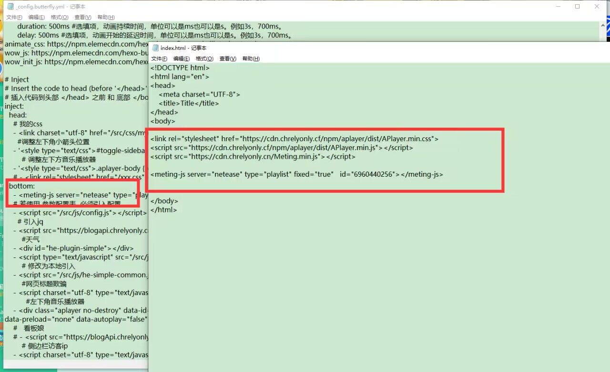
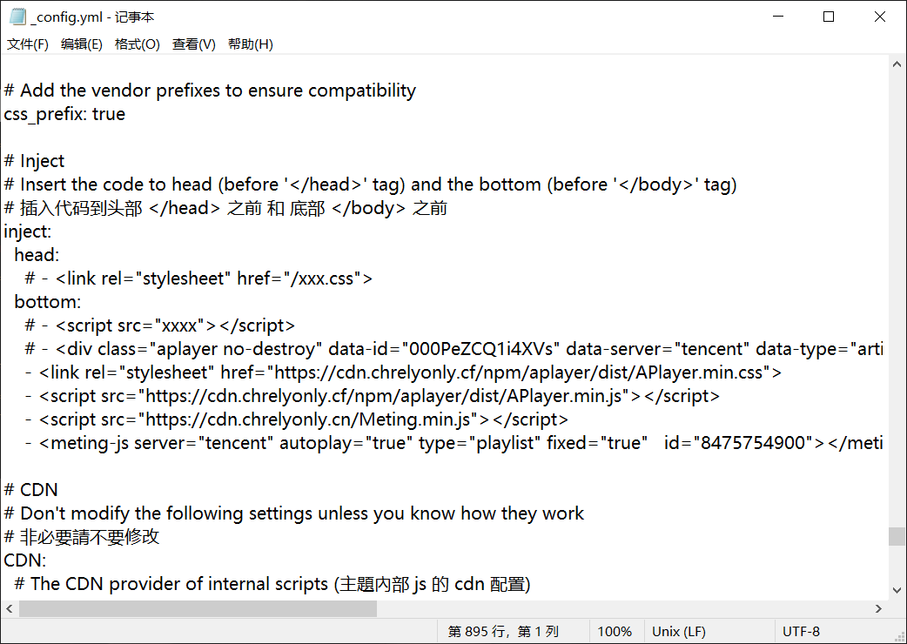

参考链接：https://github.com/metowolf/MetingJS

需要安装aplayer插件：hexo-tag-aplayer

### 使用格式

1.在音乐页的index添加如下代码：

<!-- require APlayer -->
<link rel="stylesheet" href="https://cdn.jsdelivr.net/npm/aplayer/dist/APlayer.min.css">
<script src="https://cdn.jsdelivr.net/npm/aplayer/dist/APlayer.min.js"></script>
<!-- require MetingJS -->
<script src="https://cdn.jsdelivr.net/npm/meting@2/dist/Meting.min.js"></script>

<meting-js
	server="netease"
	type="playlist"
	id="60198">
</meting-js>

或者(推荐下方形式)

<link rel="stylesheet" href="https://cdn.chrelyonly.cf/npm/aplayer/dist/APlayer.min.css">

<script src="https://cdn.chrelyonly.cf/npm/aplayer/dist/APlayer.min.js"></script>
<script src="https://cdn.chrelyonly.cn/Meting.min.js"></script>

<meting-js
    server="netease"
    type="playlist"
    id="6960440256">
</meting-js>

2.如果是吸底播放器，则在主题配置文件中的inject的bottom下插入以下代码：

``` - <meting-js server="netease" type="playlist" fixed="true"  id="6960440256">```

## 无视插件方法：

在主题配置文件的inject的bottom下插入以下代码即可：
<link rel="stylesheet" href="https://cdn.chrelyonly.cf/npm/aplayer/dist/APlayer.min.css">
<script src="https://cdn.chrelyonly.cf/npm/aplayer/dist/APlayer.min.js"></script>
<script src="https://cdn.chrelyonly.cn/Meting.min.js"></script>

<meting-js server="netease" type="playlist" fixed="true"  id="6960440256"></meting-js>




