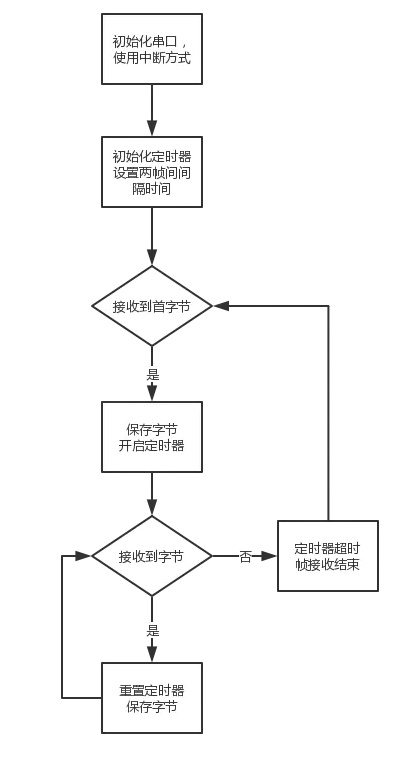

## 一、延时检测

#### 使用定时器判断

这种方法建立在两帧数据不可能连续发送的基础上，也是modbus判断帧结束的方式，在接受到第一个字节的时候打开定时器，如果继续接收到数据则更新定时器，在被设定时间内没有接收到数据则定时器超时，标志一帧数据接收完毕。

#### 关于定时器的设定时间有几个问题：

- 其一是如果定时器超时时间大于发送两帧数据的时间间隔，则接收到的一帧数据实际上是几帧，更可能定时器无法超时，一直处于接收状态。
- 其二是如果定时器超时小于发生两个字节的时间间隔，则在接收到1个字节定时器就超时了。

我们于是只能设定一个尽量小但又不影响接收连续字节的时间，例如ModBus通信时规定发送完一组命令必须间隔3.5个字符时间间隔再发送下一组新命令，这里规定的便是定时器的超时时间。

#### 关于时间的计算

首先，1个字符窗口包含起始位，数据位，校验位，停止位，其中有些位长度不一定，这里我们按1+8+1+1来计算。波特率表示的意思是在1000ms内可以传送的位数，设3.5个字节所用时间为X，波特率为9600则:
 3.5*11 / X  = 9600 / 1000
 X = 4.010416666666667 ms
 X代表的意思是两帧数据间隔时间至少为此，我们程序的超时定时器可以设定为4ms。同时也知道波特率变化是会影响该值。

## 二、解析协议方式

该方式便是通过协议中的保存的长度、包头、包尾等信息来判断帧接收完成。通常是将数据保存在一个循环buffer中，从中去找对应信息，根据信息判断取出一帧数据还是继续等待。

## 三、空闲中断

在STM32中有个串口空闲中断，在总线由忙碌转为空闲时(RXNE被置为)参数这个中断，我们可以利用这个中断来知道一帧传输接收，需要进行处理。

##### 更多信息请查看：

[如何判断串口接收完成一帧数据](https://www.jianshu.com/p/bb0ab9a58eff#:~:text=%E5%A6%82%E4%BD%95%E5%88%A4%E6%96%AD%E4%B8%B2%E5%8F%A3%E6%8E%A5%E6%94%B6%E5%AE%8C%E6%88%90%E4%B8%80%E5%B8%A7%E6%95%B0%E6%8D%AE%201%201%20%E4%BD%BF%E7%94%A8%E5%AE%9A%E6%97%B6%E5%99%A8%E5%88%A4%E6%96%AD%20%E8%BF%99%E7%A7%8D%E6%96%B9%E5%BC%8F%E5%BB%BA%E7%AB%8B%E5%9C%A8%E4%B8%A4%E5%B8%A7%E6%95%B0%E6%8D%AE%E4%B8%8D%E5%8F%AF%E8%83%BD%E8%BF%9E%E7%BB%AD%E5%8F%91%E9%80%81%E7%9A%84%E5%9F%BA%E7%A1%80%E4%B8%8A%EF%BC%8C%E4%B9%9F%E6%98%AFmodbus%E5%88%A4%E6%96%AD%E5%B8%A7%E7%BB%93%E6%9D%9F%E7%9A%84%E6%96%B9%E5%BC%8F%EF%BC%8C%E5%9C%A8%E6%8E%A5%E6%94%B6%E5%88%B0%E7%AC%AC%E4%B8%80%E4%B8%AA%E5%AD%97%E8%8A%82%E7%9A%84%E6%97%B6%E5%80%99%E6%89%93%E5%BC%80%E5%AE%9A%E6%97%B6%E5%99%A8%EF%BC%8C%E5%A6%82%E6%9E%9C%E7%BB%A7%E7%BB%AD%E6%8E%A5%E6%94%B6%E5%88%B0%E6%95%B0%E6%8D%AE%E5%88%99%E6%9B%B4%E6%96%B0%E5%AE%9A%E6%97%B6%E5%99%A8%EF%BC%8C%E5%9C%A8%E8%A2%AB%E8%AE%BE%E5%AE%9A%E6%97%B6%E9%97%B4%E5%86%85%E6%B2%A1%E6%9C%89%E6%8E%A5%E6%94%B6%E5%88%B0%E6%95%B0%E6%8D%AE%E5%88%99%E5%AE%9A%E6%97%B6%E5%99%A8%E8%B6%85%E6%97%B6%E3%80%82%20enter%20image%20description,%E9%80%9A%E5%B8%B8%E6%98%AF%E5%B0%86%E6%95%B0%E6%8D%AE%E4%BF%9D%E5%AD%98%E5%9C%A8%E4%B8%80%E4%B8%AA%E5%BE%AA%E7%8E%AFbuffer%E4%B8%AD%EF%BC%8C%E4%BB%8E%E4%B8%AD%E5%8E%BB%E6%89%BE%E5%AF%B9%E5%BA%94%E4%BF%A1%E6%81%AF%EF%BC%8C%E6%A0%B9%E6%8D%AE%E4%BF%A1%E6%81%AF%E5%88%A4%E6%96%AD%E5%8F%96%E5%87%BA%E4%B8%80%E5%B8%A7%E6%95%B0%E6%8D%AE%E8%BF%98%E6%98%AF%E7%BB%A7%E7%BB%AD%E7%AD%89%E5%BE%85%E3%80%82%203%203%20%E7%A9%BA%E9%97%B2%E4%B8%AD%E6%96%AD%20%E5%9C%A8STM32%E4%B8%AD%E6%9C%89%E4%B8%AA%E4%B8%B2%E5%8F%A3%E7%A9%BA%E9%97%B2%E4%B8%AD%E6%96%AD%EF%BC%8C%E5%9C%A8%E6%80%BB%E7%BA%BF%E7%94%B1%E5%BF%99%E7%A2%8C%E8%BD%AC%E4%B8%BA%E7%A9%BA%E9%97%B2%E6%97%B6%20%28RXNE%E8%A2%AB%E7%BD%AE%E4%B8%BA%29%E5%8F%82%E6%95%B0%E8%BF%99%E4%B8%AA%E4%B8%AD%E6%96%AD%EF%BC%8C%E6%88%91%E4%BB%AC%E5%8F%AF%E4%BB%A5%E5%88%A9%E7%94%A8%E8%BF%99%E4%B8%AA%E4%B8%AD%E6%96%AD%E6%9D%A5%E7%9F%A5%E9%81%93%E4%B8%80%E5%B8%A7%E4%BC%A0%E8%BE%93%E6%8E%A5%E6%94%B6%EF%BC%8C%E9%9C%80%E8%A6%81%E8%BF%9B%E8%A1%8C%E5%A4%84%E7%90%86%E3%80%82%20%E4%B8%8B%E9%9D%A2%E6%98%AFSMT32L151%E7%9A%84%E7%A4%BA%E4%BE%8B%E4%BB%A3%E7%A0%81%EF%BC%8C%E9%A6%96%E5%85%88%E5%9C%A8%E4%B8%B2%E5%8F%A3%E5%88%9D%E5%A7%8B%E5%8C%96%E6%97%B6%EF%BC%8C%E4%B9%9F%E4%BD%BF%E8%83%BD%E7%A9%BA%E9%97%B2%E4%B8%AD%E6%96%AD%20)
